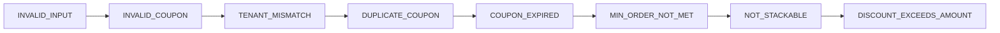

# 多重錯誤的回報順序

一次結帳同時命中多種失敗情況時，依固定順序只回報第一個命中的失敗原因。

- rule_id：R-MULTI_TENANT_COUPON-018

```mermaid
flowchart LR
  A[INVALID_INPUT] --> B[INVALID_COUPON] --> C[TENANT_MISMATCH] --> D[DUPLICATE_COUPON] --> E[COUPON_EXPIRED] --> F[MIN_ORDER_NOT_MET] --> G[NOT_STACKABLE] --> H[DISCOUNT_EXCEEDS_AMOUNT]
```

## 白話複述
1. 同時有多個錯誤 → 依上圖由左到右檢查，回報第一個命中的（R-018）

確認時間：2026-10-20 15:19
