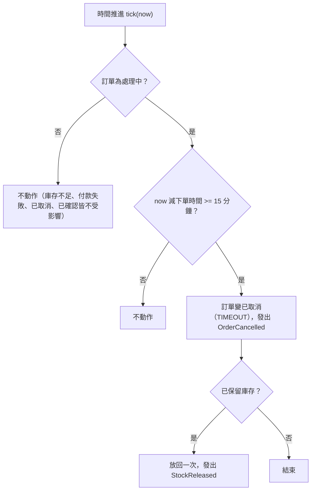

# 逾時自動取消
- **涵蓋 rule_id**：R-EVENT_DRIVEN_ORDER-004
- **確認時間**：2026-11-01 02:45

```mermaid
flowchart TD
  A["時間推進 tick(now)"] --> B{"訂單為處理中？"}
  B -- "否" --> C["不動作（庫存不足、付款失敗、已取消、已確認皆不受影響）"]
  B -- "是" --> D{"now 減下單時間 >= 15 分鐘？"}
  D -- "否" --> E["不動作"]
  D -- "是" --> F["訂單變已取消（TIMEOUT），發出 OrderCancelled"]
  F --> G{"已保留庫存？"}
  G -- "是" --> H["放回一次，發出 StockReleased"]
  G -- "否" --> I["結束"]
```

## 白話複述
1. 下單滿 15 分鐘仍為處理中：自動取消，原因 TIMEOUT，有保留則放回並發 StockReleased（R-004）

## 已知取捨
- X-EVENT_DRIVEN_ORDER-001：不碰資料庫或網路
