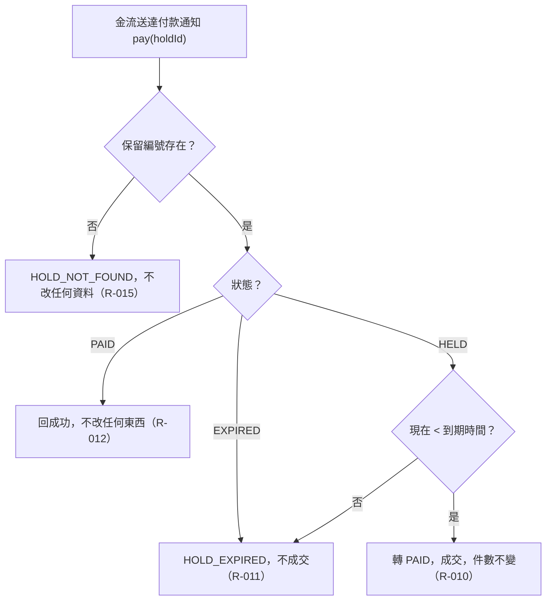

# 付款成交

- rule_id：R-FLASH_SALE-000（尾段）、010、011、012、015
- 確認時間：2026-11-02 02:26

```mermaid
flowchart TD
  A["金流送達付款通知 pay(holdId)"] --> B{"保留編號存在？"}
  B -- 否 --> C["HOLD_NOT_FOUND，不改任何資料（R-015）"]
  B -- 是 --> D{"狀態？"}
  D -- PAID --> E["回成功，不改任何東西（R-012）"]
  D -- EXPIRED --> F["HOLD_EXPIRED，不成交（R-011）"]
  D -- HELD --> G{"現在 < 到期時間？"}
  G -- 否 --> F
  G -- 是 --> H["轉 PAID，成交，件數不變（R-010）"]
```

白話複述：付款以付款當下時間判斷；到期時刻（含）後拒絕；已成交重送回成功不改資料；找不到保留拒絕（R-000 尾段、R-010～012、R-015）。

已知取捨：無。
