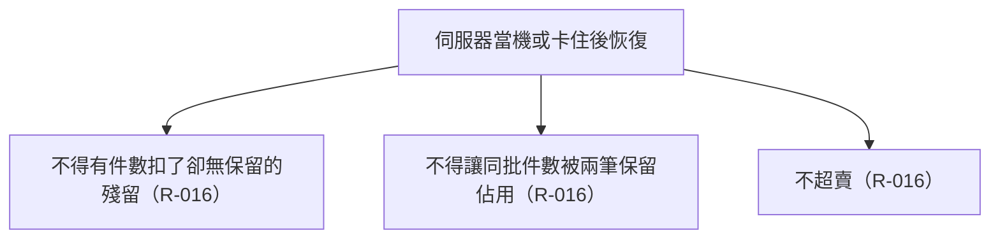

# 併發與故障

- rule_id：R-FLASH_SALE-016
- 確認時間：2026-11-02 02:26

```mermaid
flowchart TD
  A["伺服器當機或卡住後恢復"] --> B["不得有件數扣了卻無保留的殘留（R-016）"]
  A --> C["不得讓同批件數被兩筆保留佔用（R-016）"]
  A --> D["不超賣（R-016）"]
```

白話複述：故障恢復後不產生殘留件數、不重複佔用、不超賣（R-016）。

已知取捨：無。
