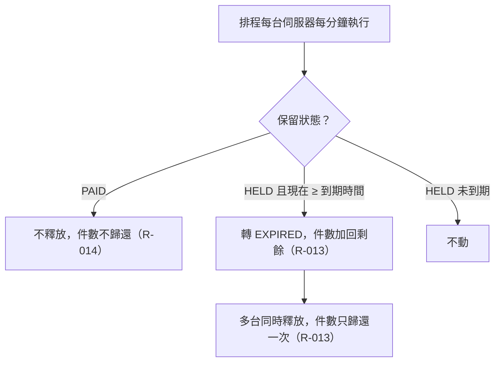

# 到期釋放

- rule_id：R-FLASH_SALE-013、014
- 確認時間：2026-11-02 02:26

```mermaid
flowchart TD
  A["排程每台伺服器每分鐘執行"] --> B{"保留狀態？"}
  B -- PAID --> C["不釋放，件數不歸還（R-014）"]
  B -- HELD 且現在 ≥ 到期時間 --> D["轉 EXPIRED，件數加回剩餘（R-013）"]
  B -- HELD 未到期 --> E["不動"]
  D --> F["多台同時釋放，件數只歸還一次（R-013）"]
```

白話複述：到期（含到期時刻）未付款的保留轉為 EXPIRED 並歸還件數；已成交不釋放；多台同時執行只歸還一次（R-013、014）。

已知取捨：無。
