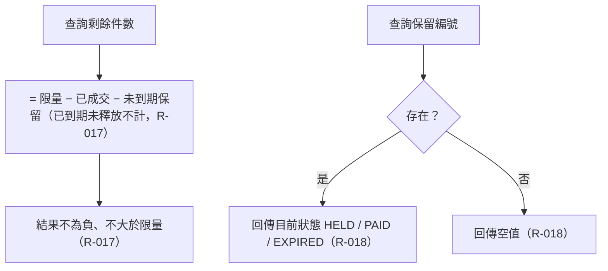

# 剩餘件數與查詢

- rule_id：R-FLASH_SALE-017、018
- 確認時間：2026-11-02 02:26

```mermaid
flowchart TD
  A["查詢剩餘件數"] --> B["= 限量 − 已成交 − 未到期保留（已到期未釋放不計，R-017）"]
  B --> C["結果不為負、不大於限量（R-017）"]
  D["查詢保留編號"] --> E{"存在？"}
  E -- 是 --> F["回傳目前狀態 HELD / PAID / EXPIRED（R-018）"]
  E -- 否 --> G["回傳空值（R-018）"]
```

白話複述：剩餘件數與搶購判斷口徑一致；查詢保留回傳目前狀態或空值（R-017、018）。

已知取捨：無。
