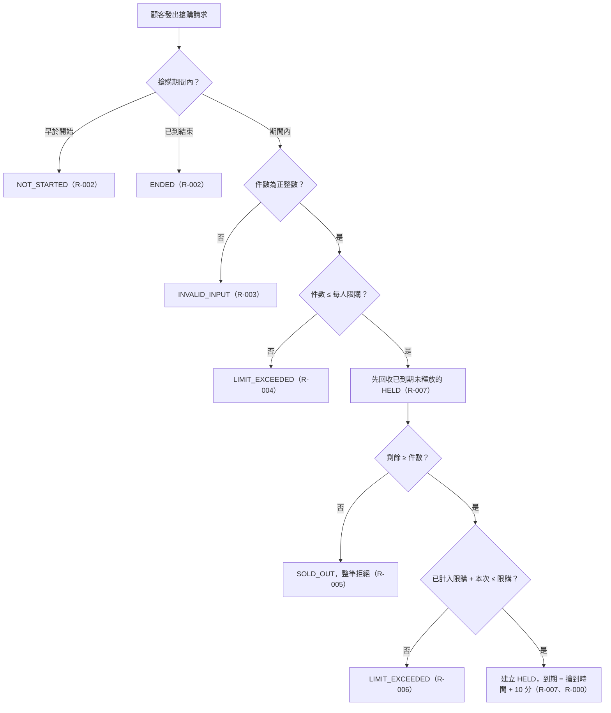

# 搶購判斷

- rule_id：R-FLASH_SALE-000、002、003、004、005、006、007
- 確認時間：2026-11-02 02:26

```mermaid
flowchart TD
  A["顧客發出搶購請求"] --> B{"搶購期間內？"}
  B -- 早於開始 --> C["NOT_STARTED（R-002）"]
  B -- 已到結束 --> D["ENDED（R-002）"]
  B -- 期間內 --> E{"件數為正整數？"}
  E -- 否 --> F["INVALID_INPUT（R-003）"]
  E -- 是 --> G{"件數 ≤ 每人限購？"}
  G -- 否 --> H["LIMIT_EXCEEDED（R-004）"]
  G -- 是 --> I["先回收已到期未釋放的 HELD（R-007）"]
  I --> J{"剩餘 ≥ 件數？"}
  J -- 否 --> K["SOLD_OUT，整筆拒絕（R-005）"]
  J -- 是 --> L{"已計入限購 + 本次 ≤ 限購？"}
  L -- 否 --> M["LIMIT_EXCEEDED（R-006）"]
  L -- 是 --> N["建立 HELD，到期 = 搶到時間 + 10 分（R-007、R-000）"]
```

白話複述：期間外拒絕；件數不合法拒絕；超過每人限購拒絕；剩餘不足整筆拒絕；限購計入保留中與已成交、不計已釋放；全部符合則建立 10 分鐘保留（R-000、002～007）。

已知取捨：無。
