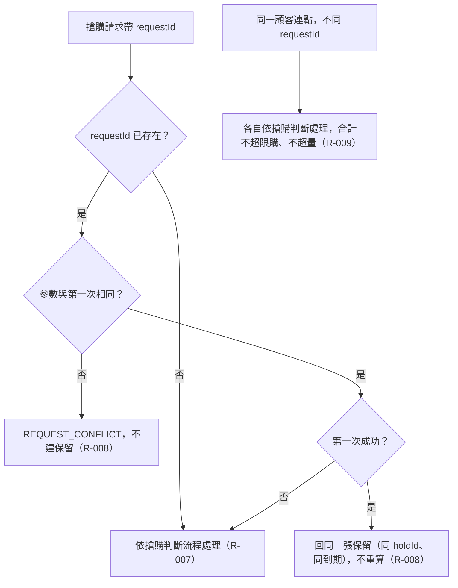

# 重送與連點

- rule_id：R-FLASH_SALE-008、009
- 確認時間：2026-11-02 02:26

```mermaid
flowchart TD
  A["搶購請求帶 requestId"] --> B{"requestId 已存在？"}
  B -- 否 --> C["依搶購判斷流程處理（R-007）"]
  B -- 是 --> D{"參數與第一次相同？"}
  D -- 否 --> E["REQUEST_CONFLICT，不建保留（R-008）"]
  D -- 是 --> F{"第一次成功？"}
  F -- 是 --> G["回同一張保留（同 holdId、同到期），不重算（R-008）"]
  F -- 否 --> C
  A2["同一顧客連點，不同 requestId"] --> H["各自依搶購判斷處理，合計不超限購、不超量（R-009）"]
```

白話複述：重送回同一張保留或依新請求判斷；參數不同拒絕；連點各自判斷但總量受限（R-008、009）。

已知取捨：無。
