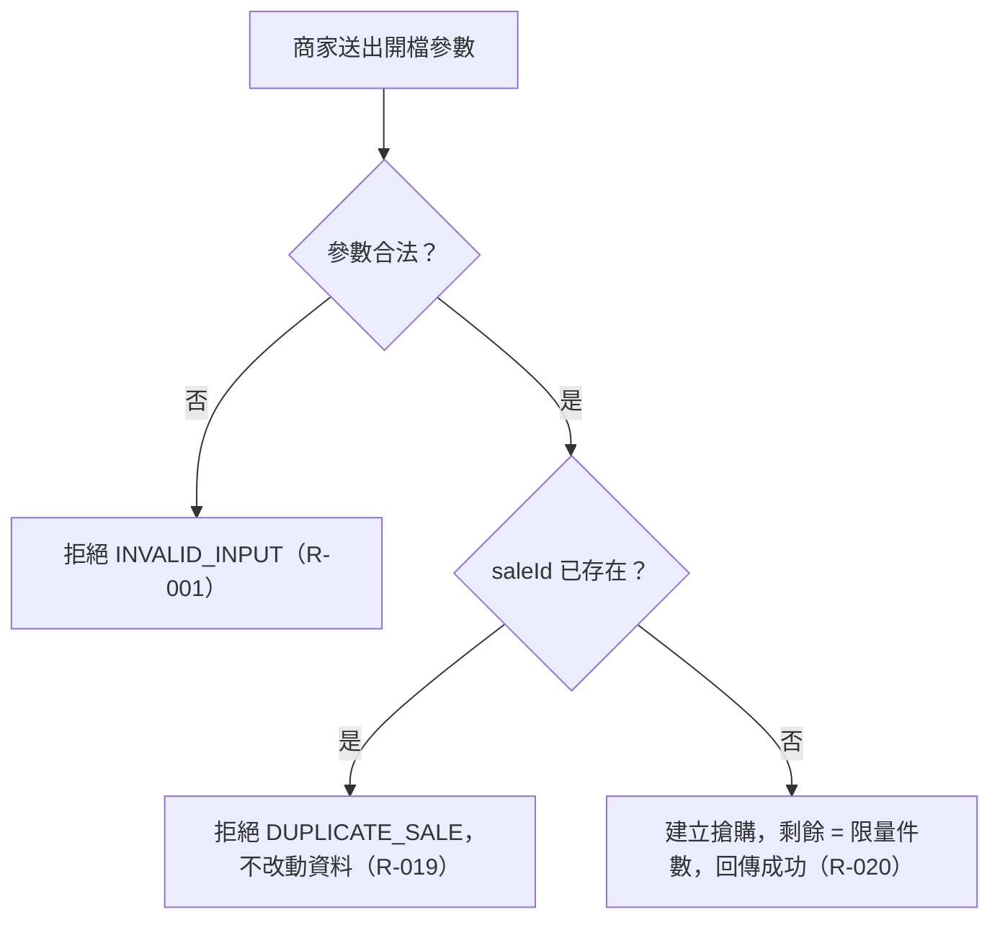

# 開檔

- rule_id：R-FLASH_SALE-001、019、020
- 確認時間：2026-11-02 02:26

```mermaid
flowchart TD
  A["商家送出開檔參數"] --> B{"參數合法？"}
  B -- 否 --> C["拒絕 INVALID_INPUT（R-001）"]
  B -- 是 --> D{"saleId 已存在？"}
  D -- 是 --> E["拒絕 DUPLICATE_SALE，不改動資料（R-019）"]
  D -- 否 --> F["建立搶購，剩餘 = 限量件數，回傳成功（R-020）"]
```

白話複述：參數不合法或重複 saleId 都拒絕；合法且新的搶購即建立（R-001、R-019、R-020）。

已知取捨：無。
